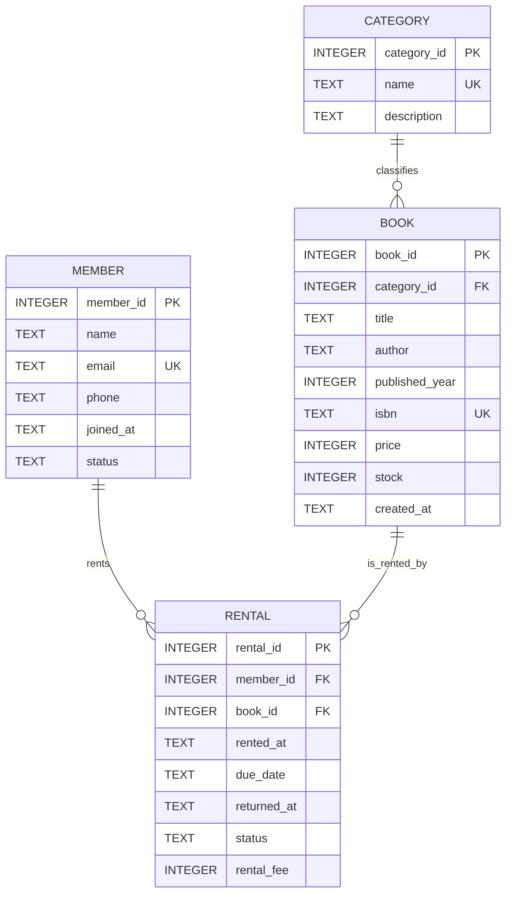

# ERD - 도서 대여 관리 DB

## 관계 설명

- `category 1 : N book`
  - 하나의 카테고리는 여러 권의 도서를 가질 수 있다.
  - 하나의 도서는 반드시 하나의 카테고리에 속한다.
- `member 1 : N rental`
  - 한 명의 회원은 여러 대여 기록을 가질 수 있다.
  - 하나의 대여 기록은 반드시 한 명의 회원에게 속한다.
- `book 1 : N rental`
  - 한 권의 도서는 여러 번 대여될 수 있다.
  - 하나의 대여 기록은 반드시 한 권의 도서와 연결된다.
