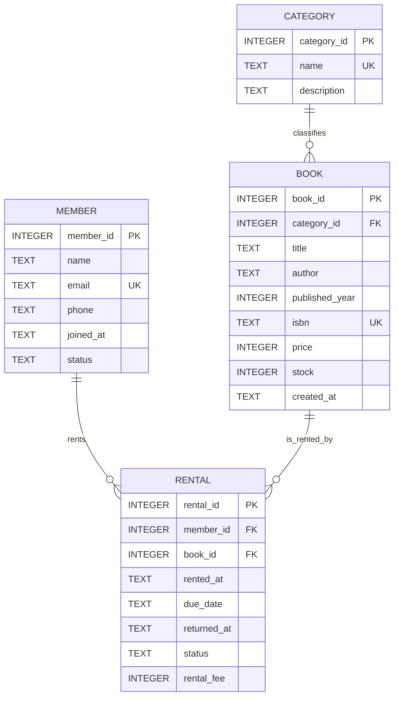

# ERD - 도서 대여 관리 DB

한 줄 요약: 회원, 도서, 카테고리, 대여 기록이 어떤 관계로 연결되는지 보여 주는 데이터베이스 설계도이다.

이 문서는 도서 대여 관리 DB의 테이블 구조와 관계를 설명한다. ERD를 보면 어떤 테이블이 어떤 정보를 담당하는지, 어떤 컬럼이 다른 테이블과 연결되는지, 잘못된 데이터 입력을 막기 위해 어떤 제약조건을 사용했는지 한눈에 확인할 수 있다.

## 실습 따라하기

전체 DB를 다시 만들고 결과를 확인하려면 프로젝트 루트에서 아래 명령을 실행한다.

```bash
bash scripts/run_all.sh
```

생성된 SQLite DB의 실제 테이블 구조를 확인하려면 아래 명령을 실행한다.

```bash
sqlite3 book_rental.db ".schema"
```

외래키 참조가 깨진 데이터가 있는지 확인하려면 아래 SQL을 실행한다.

```sql
PRAGMA foreign_key_check;
```

결과가 아무것도 나오지 않으면 외래키 관계가 정상이라는 뜻이다.

## 핵심 키워드

- `ERD`: 테이블과 테이블 사이의 관계를 그림으로 표현한 설계도
- `PK`: 각 행을 유일하게 구분하는 기본키
- `FK`: 다른 테이블의 기본키를 참조하는 외래키
- `1:N`: 한 행이 다른 테이블의 여러 행과 연결될 수 있는 관계
- `UNIQUE`: 중복 값을 막는 제약조건
- `NOT NULL`: 빈 값을 허용하지 않는 제약조건
- `CHECK`: 허용 가능한 값의 범위를 제한하는 제약조건
- `DEFAULT`: 값을 입력하지 않았을 때 자동으로 들어가는 기본값
- `ON UPDATE CASCADE`: 참조 대상 키가 바뀌면 연결된 FK도 함께 갱신
- `ON DELETE RESTRICT`: 참조 중인 데이터가 있으면 삭제를 막음

## ERD 다이어그램



## ERD 읽는 법

Mermaid ERD에서 `||--o{`는 왼쪽 테이블의 한 행이 오른쪽 테이블의 여러 행과 연결될 수 있다는 뜻이다. 쉽게 말해 `1:N` 관계이다.

이 프로젝트에서는 다음처럼 읽을 수 있다.

- `MEMBER ||--o{ RENTAL`: 한 명의 회원은 대여 기록을 0개 이상 가질 수 있다.
- `BOOK ||--o{ RENTAL`: 한 권의 도서는 여러 번 대여될 수 있다.
- `CATEGORY ||--o{ BOOK`: 하나의 카테고리는 여러 권의 도서를 포함할 수 있다.

오른쪽의 `o{`는 "없을 수도 있고 여러 개일 수도 있다"는 뜻이다. 예를 들어 아직 책을 한 번도 빌리지 않은 회원도 있을 수 있으므로 `member` 입장에서는 연결된 `rental`이 0개일 수 있다.

## 테이블별 역할

| 테이블 | 역할 | 예시 데이터 |
| --- | --- | --- |
| `member` | 도서관 회원 정보를 저장한다. | 회원명, 이메일, 가입일, 회원 상태 |
| `category` | 책을 분야별로 묶기 위한 분류 정보를 저장한다. | Database, AI, Backend |
| `book` | 실제 대여 대상인 도서 정보를 저장한다. | 제목, 저자, ISBN, 가격, 재고 |
| `rental` | 누가 어떤 책을 언제 빌렸는지 저장하는 대여 사건 테이블이다. | 회원 ID, 도서 ID, 대여일, 반납기한, 상태 |

`rental`은 특히 중요하다. 회원과 도서는 직접 연결되는 것이 아니라, "대여했다"라는 사건을 통해 연결된다. 그래서 `rental` 테이블에는 `member_id`와 `book_id`가 함께 들어간다.

## 관계 설명

- `category 1 : N book`
  - 하나의 카테고리는 여러 권의 도서를 가질 수 있다.
  - 하나의 도서는 반드시 하나의 카테고리에 속한다.
- `member 1 : N rental`
  - 한 명의 회원은 여러 대여 기록을 가질 수 있다.
  - 하나의 대여 기록은 반드시 한 명의 회원에게 속한다.
- `book 1 : N rental`
  - 한 권의 도서는 여러 번 대여될 수 있다.
  - 하나의 대여 기록은 반드시 한 권의 도서와 연결된다.

## 테이블별 제약조건 설명

### `member`

회원 정보를 저장하는 테이블이다.

- `member_id`: 회원 한 명을 구분하는 기본키이다.
- `email`: 같은 이메일이 두 번 들어가지 않도록 `UNIQUE`를 사용한다.
- `joined_at`: 가입일은 반드시 필요하므로 `NOT NULL`이다.
- `status`: `ACTIVE`, `SUSPENDED`, `WITHDRAWN` 중 하나만 허용한다.
- `status DEFAULT 'ACTIVE'`: 상태를 따로 입력하지 않으면 기본값은 `ACTIVE`이다.

### `category`

도서 분류 정보를 저장하는 테이블이다.

- `category_id`: 카테고리 하나를 구분하는 기본키이다.
- `name`: 같은 카테고리명이 중복되지 않도록 `UNIQUE`를 사용한다.
- `description`: 카테고리 설명은 선택값이므로 비어 있을 수 있다.

### `book`

도서 정보를 저장하는 테이블이다.

- `book_id`: 도서 한 권을 구분하는 기본키이다.
- `category_id`: `category(category_id)`를 참조하는 외래키이다.
- `title`, `author`, `isbn`, `price`: 도서 관리에 필요한 필수 정보이다.
- `isbn`: 같은 ISBN이 중복되지 않도록 `UNIQUE`를 사용한다.
- `published_year`: 1900년부터 2100년 사이만 허용한다.
- `price`: 가격은 0원 이상이어야 한다.
- `stock`: 재고는 0개 이상이어야 하며, 기본값은 1이다.
- `created_at`: 도서를 등록한 시각이 기본값으로 자동 저장된다.

### `rental`

대여 기록을 저장하는 테이블이다.

- `rental_id`: 대여 기록 한 건을 구분하는 기본키이다.
- `member_id`: `member(member_id)`를 참조하는 외래키이다.
- `book_id`: `book(book_id)`를 참조하는 외래키이다.
- `rented_at`: 대여일이다.
- `due_date`: 반납기한이다.
- `returned_at`: 실제 반납일이다. 아직 반납하지 않았으면 비어 있을 수 있다.
- `status`: `RENTED`, `RETURNED`, `OVERDUE`, `LOST` 중 하나만 허용한다.
- `rental_fee`: 연체료나 수수료이며, 0원 이상이어야 한다.

## 설계 의도

한 테이블에 회원명, 이메일, 도서명, 카테고리명, 대여일을 모두 넣으면 같은 정보가 계속 반복된다. 예를 들어 한 회원이 책을 여러 번 빌릴 때마다 회원 이름과 이메일이 중복 저장된다.

이 프로젝트는 중복을 줄이고 데이터 수정 오류를 막기 위해 테이블을 역할별로 나누었다.

- 회원 정보는 `member`에 한 번만 저장한다.
- 카테고리 정보는 `category`에 한 번만 저장한다.
- 도서 정보는 `book`에 한 번만 저장한다.
- 대여가 발생할 때마다 `rental`에 기록한다.

이 구조 덕분에 회원 이메일이 바뀌어도 `member` 한 곳만 수정하면 되고, 책의 카테고리를 확인할 때도 `book`과 `category`를 JOIN해서 정확한 분류명을 가져올 수 있다.

## 삭제와 수정 규칙

외래키에는 `ON UPDATE CASCADE`, `ON DELETE RESTRICT`가 적용되어 있다.

`ON UPDATE CASCADE`는 참조 대상 키가 바뀌면 연결된 외래키도 함께 바뀌도록 하는 규칙이다. 예를 들어 어떤 카테고리의 `category_id`가 변경되면, 그 카테고리를 참조하는 `book.category_id`도 함께 갱신된다.

`ON DELETE RESTRICT`는 다른 테이블에서 참조 중인 데이터를 함부로 삭제하지 못하게 막는 규칙이다. 예를 들어 어떤 회원에게 대여 기록이 남아 있다면, 그 회원을 바로 삭제할 수 없다. 이렇게 해야 `rental`이 존재하지 않는 회원을 가리키는 잘못된 상태를 막을 수 있다.

## 평가자가 확인할 수 있는 포인트

- `member`, `category`, `book`, `rental` 네 테이블이 역할별로 분리되어 있다.
- 모든 테이블에 기본키가 있다.
- `book.category_id`, `rental.member_id`, `rental.book_id`로 외래키 관계가 설정되어 있다.
- 회원과 대여, 도서와 대여, 카테고리와 도서는 모두 1:N 관계로 설계되어 있다.
- `UNIQUE`, `CHECK`, `DEFAULT`, `NOT NULL`을 사용해 잘못된 데이터 입력을 줄였다.
- `ON DELETE RESTRICT`로 참조 무결성을 보호한다.
