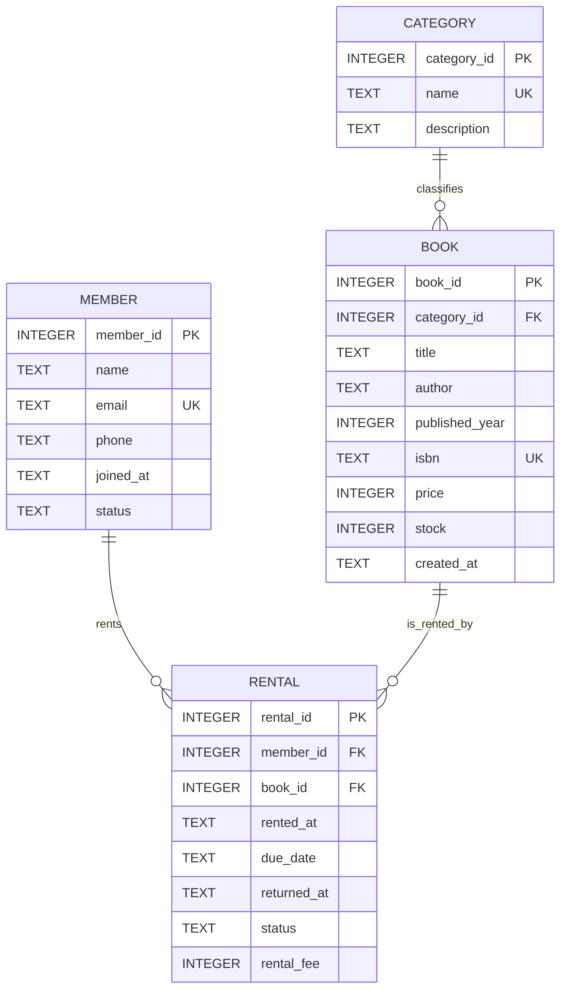

# ERD 설명 훈련

이 문서는 B5-1 도서 대여 관리 DB의 ERD를 보고 테이블 역할, PK/FK, 1:N 관계를 말로 설명하기 위한 훈련 문서이다.

평가에서는 ERD를 단순히 보여주는 것보다, **각 테이블이 무엇을 저장하는지**, **선이 어떤 FK 관계를 의미하는지**, **왜 1:N인지**, **이 관계로 어떤 JOIN이 가능한지**를 설명할 수 있어야 한다.

---

## 1. ERD 한 줄 요약

```text
member와 book은 rental을 통해 대여 이력으로 연결되고,
book은 category에 속한다.
```

평가 답변:

> 이 ERD는 도서 대여 관리 구조를 나타냅니다. 회원은 여러 대여 기록을 가질 수 있고, 도서는 여러 대여 기록에 등장할 수 있으며, 도서는 하나의 카테고리에 속합니다. 따라서 `member 1:N rental`, `book 1:N rental`, `category 1:N book` 관계로 설계했습니다.

---

## 2. ERD 원본

`docs/ERD.md`에 있는 Mermaid ERD는 다음과 같다.



---

## 3. ERD 기호 읽기

Mermaid ERD에서 이 프로젝트에 사용한 핵심 기호는 다음과 같다.

| 기호 | 의미 | 이 프로젝트 예시 |
|---|---|---|
| `||` | 정확히 하나 | 하나의 대여 기록은 반드시 한 회원에 속한다. |
| `o{` | 0개 이상 여러 개 | 한 회원은 대여 기록이 없을 수도 있고 여러 개일 수도 있다. |
| `||--o{` | 1:N 관계 | `MEMBER ||--o{ RENTAL` |

읽는 방법:

```text
MEMBER ||--o{ RENTAL
```

의미:

> 회원 1명은 대여 기록을 0개 이상 가질 수 있고, 대여 기록 1개는 반드시 회원 1명에게 속한다.

---

## 4. 테이블별 역할 설명

## 4.1 MEMBER

`MEMBER`는 도서관 회원 정보를 저장한다.

| 컬럼 | 표시 | 설명 |
|---|---|---|
| `member_id` | PK | 회원을 유일하게 식별 |
| `name` | 일반 컬럼 | 회원 이름 |
| `email` | UK | 중복되면 안 되는 이메일 |
| `phone` | 일반 컬럼 | 연락처 |
| `joined_at` | 일반 컬럼 | 가입일 |
| `status` | 일반 컬럼 | 회원 상태 |

평가 답변:

> `MEMBER`는 회원 정보를 저장하는 테이블입니다. `member_id`가 PK라서 같은 이름의 회원이 있어도 구분할 수 있고, `email`은 UNIQUE라서 중복 이메일을 막습니다.

---

## 4.2 CATEGORY

`CATEGORY`는 도서 분류 정보를 저장한다.

| 컬럼 | 표시 | 설명 |
|---|---|---|
| `category_id` | PK | 카테고리를 유일하게 식별 |
| `name` | UK | 카테고리명, 중복 불가 |
| `description` | 일반 컬럼 | 카테고리 설명 |

평가 답변:

> `CATEGORY`는 도서 분류를 저장하는 테이블입니다. 카테고리명을 `book`에 반복 저장하지 않고 별도 테이블로 분리해 중복과 오타 문제를 줄였습니다.

---

## 4.3 BOOK

`BOOK`은 도서 정보를 저장한다.

| 컬럼 | 표시 | 설명 |
|---|---|---|
| `book_id` | PK | 도서를 유일하게 식별 |
| `category_id` | FK | 이 도서가 속한 카테고리 |
| `title` | 일반 컬럼 | 도서 제목 |
| `author` | 일반 컬럼 | 저자 |
| `published_year` | 일반 컬럼 | 출판년도 |
| `isbn` | UK | 도서 고유 ISBN |
| `price` | 일반 컬럼 | 가격 |
| `stock` | 일반 컬럼 | 보유 수량 |
| `created_at` | 일반 컬럼 | 등록일 |

평가 답변:

> `BOOK`은 도서 정보를 저장합니다. `book.category_id`가 `category.category_id`를 참조하므로 책이 어떤 카테고리에 속하는지 FK로 관리합니다.

---

## 4.4 RENTAL

`RENTAL`은 대여 이력을 저장한다.

| 컬럼 | 표시 | 설명 |
|---|---|---|
| `rental_id` | PK | 대여 기록을 유일하게 식별 |
| `member_id` | FK | 누가 빌렸는지 |
| `book_id` | FK | 어떤 책을 빌렸는지 |
| `rented_at` | 일반 컬럼 | 대여일 |
| `due_date` | 일반 컬럼 | 반납기한 |
| `returned_at` | 일반 컬럼 | 실제 반납일 |
| `status` | 일반 컬럼 | 대여 상태 |
| `rental_fee` | 일반 컬럼 | 수수료 |

평가 답변:

> `RENTAL`은 회원이 도서를 빌린 사건을 기록하는 이력 테이블입니다. `member_id`와 `book_id`를 FK로 가지며, 대여일, 반납기한, 상태, 수수료까지 저장합니다.

---

## 5. 관계 1 - CATEGORY 1:N BOOK

ERD 표현:

```text
CATEGORY ||--o{ BOOK : classifies
```

관계 컬럼:

```text
category.category_id → book.category_id
```

의미:

```text
하나의 카테고리는 여러 권의 도서를 가질 수 있다.
하나의 도서는 반드시 하나의 카테고리에 속한다.
```

예시:

```text
Database 카테고리
 ├── SQL 첫걸음
 ├── 관계형 데이터베이스 설계
 └── 실전 SQL 튜닝
```

SQL 확인:

```sql
SELECT c.category_id, c.name AS category_name, b.book_id, b.title
FROM category c
INNER JOIN book b ON c.category_id = b.category_id
ORDER BY c.category_id, b.book_id;
```

평가 답변:

> `CATEGORY`와 `BOOK`은 1:N 관계입니다. 카테고리 하나에 여러 도서가 속할 수 있으므로 `book.category_id`가 `category.category_id`를 참조합니다.

---

## 6. 관계 2 - MEMBER 1:N RENTAL

ERD 표현:

```text
MEMBER ||--o{ RENTAL : rents
```

관계 컬럼:

```text
member.member_id → rental.member_id
```

의미:

```text
한 명의 회원은 여러 대여 기록을 가질 수 있다.
대여 기록 하나는 반드시 한 명의 회원에게 속한다.
```

예시:

```text
김민준 회원
 ├── 2024-06-01 SQL 첫걸음 대여
 ├── 2024-06-05 FastAPI 실전 입문 대여
 └── 2024-06-10 머신러닝 기본기 대여
```

SQL 확인:

```sql
SELECT m.member_id, m.name, r.rental_id, r.rented_at, r.status
FROM member m
INNER JOIN rental r ON m.member_id = r.member_id
ORDER BY m.member_id, r.rented_at;
```

LEFT JOIN 확인:

```sql
SELECT m.member_id, m.name, COUNT(r.rental_id) AS rental_count
FROM member m
LEFT JOIN rental r ON m.member_id = r.member_id
GROUP BY m.member_id, m.name
ORDER BY rental_count ASC, m.member_id ASC;
```

평가 답변:

> `MEMBER`와 `RENTAL`은 1:N 관계입니다. 한 회원은 여러 번 책을 빌릴 수 있지만, 하나의 대여 기록은 한 회원에게만 속합니다.

---

## 7. 관계 3 - BOOK 1:N RENTAL

ERD 표현:

```text
BOOK ||--o{ RENTAL : is_rented_by
```

관계 컬럼:

```text
book.book_id → rental.book_id
```

의미:

```text
한 권의 도서는 여러 번 대여될 수 있다.
대여 기록 하나는 반드시 한 권의 도서에 대한 기록이다.
```

예시:

```text
SQL 첫걸음
 ├── 2024-06-01 김민준 대여
 └── 2024-07-03 임수아 대여
```

SQL 확인:

```sql
SELECT b.book_id, b.title, r.rental_id, r.rented_at, r.status
FROM book b
INNER JOIN rental r ON b.book_id = r.book_id
ORDER BY b.book_id, r.rented_at;
```

평가 답변:

> `BOOK`과 `RENTAL`도 1:N 관계입니다. 한 도서는 시간에 따라 여러 번 대여될 수 있으므로 `rental.book_id`가 `book.book_id`를 참조합니다.

---

## 8. ERD를 보고 JOIN 설명하기

ERD를 보면 어떤 JOIN이 가능한지 알 수 있다.

### 8.1 대여 기록 + 회원명 + 도서명

```sql
SELECT r.rental_id, m.name AS member_name, b.title AS book_title, r.rented_at, r.status
FROM rental r
INNER JOIN member m ON r.member_id = m.member_id
INNER JOIN book b ON r.book_id = b.book_id
ORDER BY r.rented_at DESC;
```

설명:

> `rental`에는 `member_id`와 `book_id`만 있으므로 사람이 읽기 쉬운 회원명과 도서명을 보려면 `member`, `book`을 JOIN해야 한다.

---

### 8.2 대여 기록 + 회원명 + 도서명 + 카테고리명

```sql
SELECT r.rental_id, m.name AS member_name, b.title AS book_title, c.name AS category_name, r.rented_at, r.status
FROM rental r
INNER JOIN member m ON r.member_id = m.member_id
INNER JOIN book b ON r.book_id = b.book_id
INNER JOIN category c ON b.category_id = c.category_id
ORDER BY r.rented_at DESC;
```

설명:

> `rental → book → category` 순서로 연결하면 대여 기록에서 도서의 카테고리명까지 확인할 수 있다.

---

## 9. ERD를 보고 GROUP BY 설명하기

ERD에서 1:N 관계를 보면 집계 기준을 만들 수 있다.

### 9.1 회원별 대여 횟수

```sql
SELECT m.member_id, m.name, COUNT(r.rental_id) AS rental_count
FROM member m
LEFT JOIN rental r ON m.member_id = r.member_id
GROUP BY m.member_id, m.name
ORDER BY rental_count DESC;
```

설명:

> `member 1:N rental` 관계이므로 회원 1명당 여러 대여 기록을 묶어 대여 횟수를 계산할 수 있다.

---

### 9.2 카테고리별 도서 수

```sql
SELECT c.category_id, c.name AS category_name, COUNT(b.book_id) AS book_count
FROM category c
LEFT JOIN book b ON c.category_id = b.category_id
GROUP BY c.category_id, c.name
ORDER BY book_count DESC;
```

설명:

> `category 1:N book` 관계이므로 카테고리별 도서 수를 계산할 수 있다.

---

## 10. ERD 설명 순서

평가 때는 아래 순서로 말하면 안정적이다.

```text
1. 전체 주제 설명
2. 4개 테이블 역할 설명
3. PK 4개 설명
4. FK 3개 설명
5. 1:N 관계 3개 설명
6. rental이 왜 중심인지 설명
7. JOIN으로 어떤 결과를 만들 수 있는지 설명
8. GROUP BY로 어떤 지표를 만들 수 있는지 설명
```

---

## 11. 1분 설명 스크립트

> 이 ERD는 도서 대여 관리 DB입니다. `member`는 회원 정보, `category`는 도서 분류, `book`은 도서 정보, `rental`은 대여 이력을 저장합니다. `member_id`, `category_id`, `book_id`, `rental_id`가 각 테이블의 PK입니다. FK는 `book.category_id`, `rental.member_id`, `rental.book_id` 세 개입니다. 관계는 `category 1:N book`, `member 1:N rental`, `book 1:N rental`입니다. 특히 `rental`은 누가 어떤 책을 언제 빌렸는지를 저장하는 사건 테이블입니다. 그래서 `rental`을 기준으로 `member`, `book`, `category`를 JOIN하면 회원명, 도서명, 카테고리명이 포함된 대여 현황을 만들 수 있고, GROUP BY로 회원별 대여 횟수나 카테고리별 도서 수를 계산할 수 있습니다.

---

## 12. 30초 설명 스크립트

> 이 ERD는 `member`, `category`, `book`, `rental` 네 테이블로 구성됩니다. `category`는 여러 `book`을 가질 수 있고, `member`는 여러 `rental`을 가질 수 있으며, `book`도 여러 `rental`을 가질 수 있습니다. `rental`은 회원과 도서를 연결하는 대여 이력 테이블이고, FK로 실제 회원과 도서를 참조합니다.

---

## 13. 직접 설명 연습 질문

아래 질문에 ERD를 보면서 답한다.

```text
[ ] 이 ERD의 전체 주제는 무엇인가?
[ ] MEMBER 테이블은 무엇을 저장하는가?
[ ] CATEGORY 테이블은 무엇을 저장하는가?
[ ] BOOK 테이블은 무엇을 저장하는가?
[ ] RENTAL 테이블은 무엇을 저장하는가?
[ ] PK 4개는 무엇인가?
[ ] FK 3개는 무엇인가?
[ ] CATEGORY와 BOOK은 왜 1:N인가?
[ ] MEMBER와 RENTAL은 왜 1:N인가?
[ ] BOOK과 RENTAL은 왜 1:N인가?
[ ] RENTAL이 없으면 어떤 요구사항을 풀기 어려운가?
[ ] ERD를 보고 어떤 JOIN 쿼리를 만들 수 있는가?
[ ] ERD를 보고 어떤 GROUP BY 지표를 만들 수 있는가?
```

---

## 14. ERD 기반 실습 SQL

SQLite에서 직접 실행한다.

```sql
-- 1. 카테고리별 도서 목록
SELECT c.name AS category_name, b.title, b.author
FROM category c
INNER JOIN book b ON c.category_id = b.category_id
ORDER BY c.name, b.title;

-- 2. 회원별 대여 기록
SELECT m.name AS member_name, r.rental_id, r.rented_at, r.status
FROM member m
INNER JOIN rental r ON m.member_id = r.member_id
ORDER BY m.name, r.rented_at;

-- 3. 도서별 대여 기록
SELECT b.title, r.rental_id, r.rented_at, r.status
FROM book b
INNER JOIN rental r ON b.book_id = r.book_id
ORDER BY b.title, r.rented_at;

-- 4. 대여 기록 전체 설명용 JOIN
SELECT r.rental_id, m.name AS member_name, b.title AS book_title, c.name AS category_name, r.rented_at, r.due_date, r.status
FROM rental r
INNER JOIN member m ON r.member_id = m.member_id
INNER JOIN book b ON r.book_id = b.book_id
INNER JOIN category c ON b.category_id = c.category_id
ORDER BY r.rented_at DESC;

-- 5. 회원별 대여 횟수
SELECT m.member_id, m.name, COUNT(r.rental_id) AS rental_count
FROM member m
LEFT JOIN rental r ON m.member_id = r.member_id
GROUP BY m.member_id, m.name
ORDER BY rental_count DESC, m.member_id ASC;
```

---

## 15. 평가에서 자주 나오는 질문과 답변

### 질문 1. ERD에서 가장 중요한 테이블은 무엇인가요?

> 분석 관점에서는 `rental`이 가장 중요합니다. 대여 이력을 중심으로 회원, 도서, 카테고리를 연결하면 대여 현황, 연체 현황, 회원별 대여 횟수 같은 지표를 만들 수 있기 때문입니다.

### 질문 2. `member`와 `rental`은 왜 1:N인가요?

> 한 명의 회원은 여러 번 책을 빌릴 수 있지만, 하나의 대여 기록은 한 명의 회원에게만 속하기 때문입니다.

### 질문 3. `book`과 `rental`은 왜 1:N인가요?

> 한 권의 책은 시간이 지나면서 여러 번 대여될 수 있지만, 하나의 대여 기록은 특정 책 한 권에 대한 기록이기 때문입니다.

### 질문 4. `category`와 `book`은 왜 1:N인가요?

> 하나의 카테고리에는 여러 책이 속할 수 있지만, 이 프로젝트에서는 하나의 책이 하나의 카테고리에 속하도록 설계했기 때문입니다.

### 질문 5. ERD가 쿼리 작성에 어떤 도움을 주나요?

> ERD를 보면 어떤 테이블을 어떤 키로 JOIN해야 하는지 알 수 있습니다. 예를 들어 대여 기록에 회원명과 도서명을 붙이려면 `rental.member_id = member.member_id`, `rental.book_id = book.book_id`로 JOIN하면 됩니다.

---

## 16. 오늘의 완료 기준

```text
[ ] ERD를 보고 4개 테이블 역할을 설명했다.
[ ] ERD를 보고 PK 4개를 설명했다.
[ ] ERD를 보고 FK 3개를 설명했다.
[ ] 1:N 관계 3개를 설명했다.
[ ] rental이 중심 테이블인 이유를 설명했다.
[ ] ERD 기반 JOIN 쿼리 2개를 직접 작성했다.
[ ] ERD 기반 GROUP BY 쿼리 1개를 직접 작성했다.
[ ] 1분 설명 스크립트를 소리 내어 읽었다.
```
